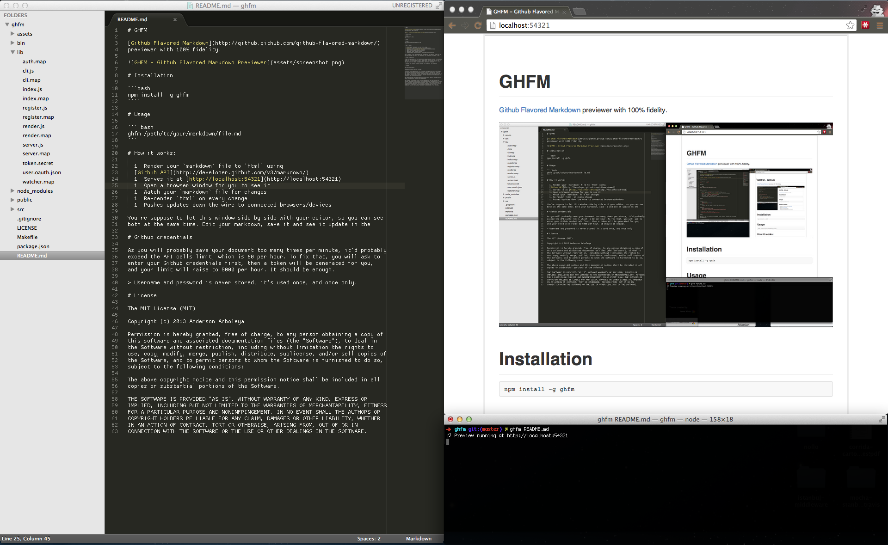

# GHFM

[Github Flavored Markdown](http://github.github.com/github-flavored-markdown/)
previewer with 100% fidelity.



# Installation

```bash
npm install -g ghfm
````

# Usage
 
````bash
ghfm /path/to/your/markdown/file.md
````

# How it works:
  
  1. Render your `markdown` file to `html` using
  [Github API](http://developer.github.com/v3/markdown/)
  1. Serves it at [http://localhost:54321](http://localhost:54321)
  1. Open a browser window for you to see it
  1. Watch your `markdown` file for changes
  1. Re-render `html` on every change
  1. Pushes updates down the wire to connected browsers/devices

# Github credentials

As you will probably save your document too many times per minute, it'd probably
exceed the API calls limit, which is 60 per hour. To fix that, you will be asked
to enter your Github credentials, then a token will be generated for you and
your limit will raise to 5,000 calls per hour. It should be enough.

> Username and password is never stored, it's used once, and once only.

## Two factor authentication

In case you're already using [2FA](https://help.github.com/articles/about-two-factor-authentication) on Github, please refer to this issue:
https://github.com/arboleya/ghfm/issues/3#issuecomment-42074126


# License

The MIT License (MIT)

Copyright (c) 2013 Anderson Arboleya

Permission is hereby granted, free of charge, to any person obtaining a copy of
this software and associated documentation files (the "Software"), to deal in
the Software without restriction, including without limitation the rights to
use, copy, modify, merge, publish, distribute, sublicense, and/or sell copies of
the Software, and to permit persons to whom the Software is furnished to do so,
subject to the following conditions:

The above copyright notice and this permission notice shall be included in all
copies or substantial portions of the Software.

THE SOFTWARE IS PROVIDED "AS IS", WITHOUT WARRANTY OF ANY KIND, EXPRESS OR
IMPLIED, INCLUDING BUT NOT LIMITED TO THE WARRANTIES OF MERCHANTABILITY, FITNESS
FOR A PARTICULAR PURPOSE AND NONINFRINGEMENT. IN NO EVENT SHALL THE AUTHORS OR
COPYRIGHT HOLDERS BE LIABLE FOR ANY CLAIM, DAMAGES OR OTHER LIABILITY, WHETHER
IN AN ACTION OF CONTRACT, TORT OR OTHERWISE, ARISING FROM, OUT OF OR IN
CONNECTION WITH THE SOFTWARE OR THE USE OR OTHER DEALINGS IN THE SOFTWARE.